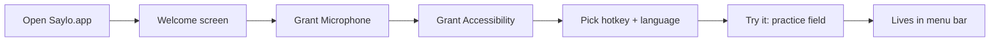
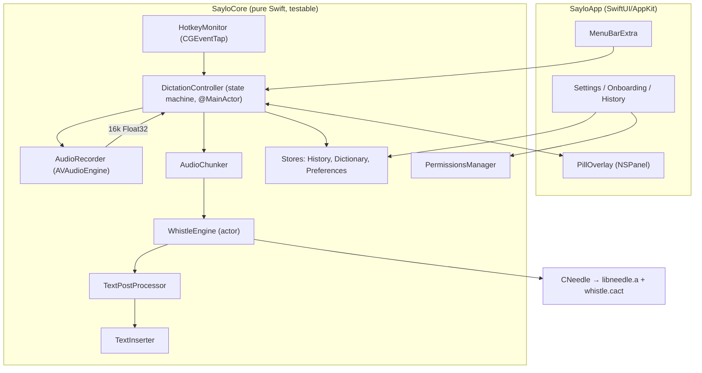
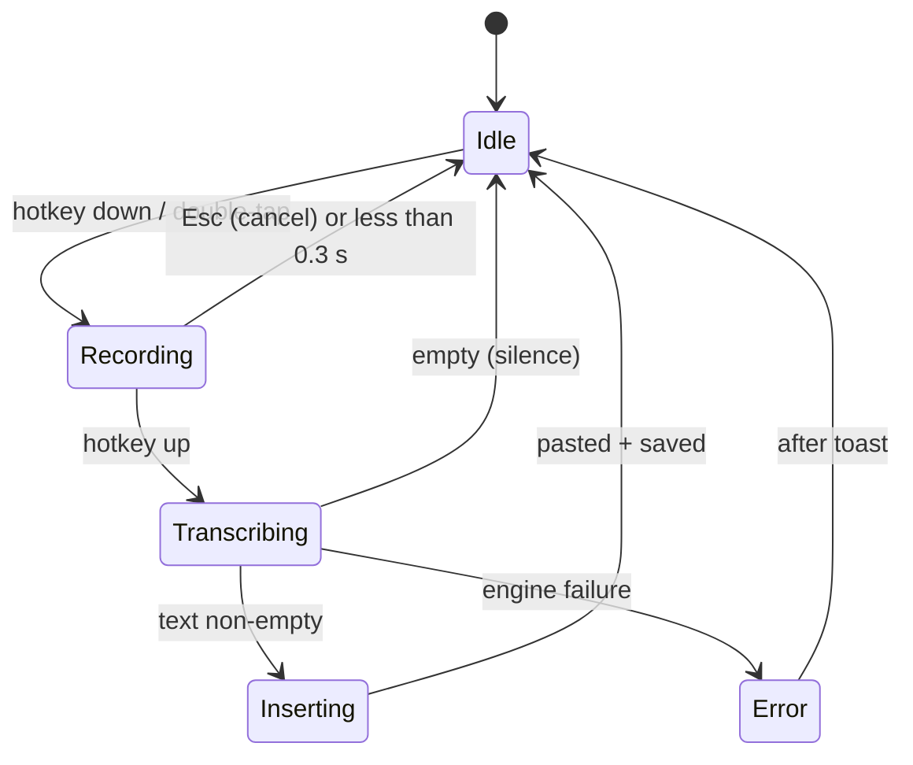

# Saylo — Full App Plan (Tech Stack, Workflow, Architecture)

## Goal
**Saylo** is a push-to-talk dictation app for macOS, a local-first take on **Wispr Flow**. You **hold a key in any app, speak, and let go**, and Saylo types the cleaned-up text where your cursor is. Speech recognition runs **entirely on your Mac** using Cactus **Whistle**, a 16.9 MB CPU speech-to-text model released on 2026-10-02. Audio never leaves the machine, there's no subscription, and it's fast enough to feel instant.

**Target machine:** Apple M2, 8 GB RAM, macOS 27.0.1, Swift 6.4 (Command Line Tools installed; Xcode is not).

## Current Status (updated 20:54)

| Item | State |
|---|---|
| Phase 0: engine + model downloaded to `vendor/` | ✅ |
| Whistle on M2: `"Hello from Salo. This is a quick dictation test."`, **ttft 33.9 ms, 836 tok/s, 0.5 s cold CLI run including model load** | ✅ (says "Salo" instead of "Saylo"; keyword biasing + dictionary will fix it) |
| `needle.h` read; real C API confirmed (below) | ✅ |
| Phase 1 sources written (`Package.swift`, `WhistleEngine`, `AudioRecorder`, `AudioChunker`, `TextPostProcessor`, CLI, tests, `setup.sh`) | ✅ written, ⚠️ **not yet building** |
| `swift build` fails: *"Could not initialize build system: Unknown error parsing property list"* | 🔧 next: likely a toolchain/CLT issue rather than a code error (stale `.build`, or the new swift-build backend needing Xcode); try `--build-system native`, then reinstall the CLT |

**Confirmed Whistle C API (from `needle.h`):**
```c
int needle_load(const unsigned char* cact, unsigned long long n);   // model BYTES, not a path
const char* needle_last_error(void);
int needle_transcribe(const float* pcm, int samples,                 // 16 kHz mono, ≤30 s
                      const char* language,   // "en".."pl" or NULL = detect
                      const char* keywords,   // newline-separated or NULL
                      int word_timestamps, char* out, int out_capacity);
// out = {"text":"...","language":"en","ttft_ms":0.0,"decode_tps":0.0}
```
> [!NOTE]
> The engine keeps **one process-global speech model and isn't thread-safe**. That's why `WhistleEngine` is a Swift `actor`: it makes all calls run one at a time.

## User Review Required

> [!IMPORTANT]
> **Stack decision: native Swift/SwiftUI with Whistle's C engine linked into the app.** I considered Electron/Tauri and a Python backend. Native wins on RAM (important with 8 GB), latency, and how macOS handles permissions for global hotkeys and synthetic typing. It also avoids shipping a second runtime.

> [!IMPORTANT]
> **Builds with SwiftPM, so Xcode isn't required.** A script assembles and signs `Saylo.app`. Installing Xcode later is optional and only matters for notarized public distribution.

> [!WARNING]
> **Whistle limits:** at most **30 s per pass** (Saylo splits longer audio at pauses); **7 languages** (en, de, fr, es, it, nl, pl); output is **transcription only**, with no punctuation-style rewriting like Wispr's cloud LLM. Saylo's cleanup is rule-based at first, with an optional local LLM in Phase 5.

## Open Questions
1. **Hotkey:** hold **Fn** (as in Wispr Flow; the default) or **Right-⌥**? Both will be configurable. This only sets the default.
2. **Languages:** auto-detect (default), or lock to English?
3. **Branding direction:** for example warm/friendly (coral and cream, rounded), or sleek/dark (neon accent)? Any colour or logo ideas?
4. **Distribution:** personal use only (ad-hoc signing is enough), or eventually public (needs an Apple Developer ID and notarization)?

---

## 1. Tech Stack

| Layer | Choice | Why |
|---|---|---|
| Language | **Swift 6.4** (strict concurrency) | Native, fast, first-class macOS APIs |
| UI | **SwiftUI** (`MenuBarExtra`, `Settings`, windows) + **AppKit** `NSPanel` for the floating pill | SwiftUI for screens; AppKit for a borderless, non-activating overlay |
| STT engine | **Cactus Whistle** (`whistle.cact`) via **`libneedle.a` + `needle.h`** (C API: `needle_load`, `needle_transcribe`, `needle_embed`) | 16.9 MB, CPU-only, ~11 ms TTFT, keyword biasing, silence detection |
| Audio capture | **AVAudioEngine** + **AVAudioConverter** → 16 kHz mono Float32 | Low-latency mic tap; converts to the format Whistle requires |
| Global hotkey | **CGEventTap** (listens for modifier/flags changes, including Fn) | Only reliable way to detect *hold/release* of Fn system-wide |
| Text insertion | **NSPasteboard** + synthetic **⌘V** via `CGEvent`, then restore the clipboard; fallback: `CGEventKeyboardSetUnicodeString` typing | Works in nearly every app, including Electron and browsers |
| Persistence | **SwiftData** (history, dictionary) + `@AppStorage` (preferences) | Built in, no extra dependencies |
| Launch at login | **SMAppService.mainApp** | Modern API |
| Sounds/haptics | `NSSound` start/stop chimes | Feedback that recording started/stopped |
| Build | **SwiftPM** + `scripts/bundle.sh` (Info.plist, icon, `codesign -s -`) | No Xcode needed |
| Testing | **XCTest / Swift Testing** via `swift test` | Unit and integration tests run from the CLI |
| Prototyping | `.venv` + `pip install cactus-needle` | Quick check of model accuracy and speed |

---

## 2. User Workflow

### First run


### Everyday dictation
1. The cursor is in any text field (Slack, Mail, VS Code, browser…).
2. **Hold Fn.** A chime plays, and a small **pill** appears at the bottom-centre of the screen with a live waveform.
3. Speak naturally.
4. **Release Fn.** The pill switches to a "thinking" shimmer while Whistle transcribes (typically under 100 ms).
5. The cleaned text is **pasted at the cursor**, the pill fades out, and your clipboard is put back.
6. The entry is saved to **History** (searchable; copy again or delete).

**Extras:**
- **Hands-free:** double-tap Fn to lock recording on; tap again to stop.
- **Esc** while recording cancels.
- **Dictionary:** add names or jargon (such as "Saylo" or "Kubernetes"). These go to Whistle as `keywords` and are also used as replacements after transcription.

---

## 3. Architecture

### 3.1 Component diagram


### 3.2 Dictation state machine


### 3.3 Threading & performance
- **The model is loaded once at launch** inside `WhistleEngine` (an actor, so its work stays off the main thread), then kept in memory (about 17 MB).
- **Pre-warm:** one silent call to `needle_transcribe` at startup so the first real dictation isn't slow.
- The audio tap runs on the real-time audio thread and appends to a lock-protected ring buffer (up to 10 min). The **RMS level** is sent to the pill at 30 fps.
- Latency target: **release → text pasted in under 250 ms** for 10 s of speech.
- Idle CPU close to 0% (the event tap is passive; the audio engine only runs while recording).

### 3.4 Whistle integration
```swift
public actor WhistleEngine {
  public init(modelPath: URL) throws            // needle_load
  public func warmUp() throws
  public func transcribe(_ pcm: [Float],
                         language: String?,       // nil = auto-detect
                         keywords: [String]) throws -> Transcript   // needle_transcribe
}
public struct Transcript: Sendable { let text: String; let language: String; let ttftMs: Double }
```
- Audio over 30 s: `AudioChunker` looks for the quietest 80 ms window between 25 and 30 s, splits there, transcribes each chunk in turn, and joins the text.
- Model location: bundled at `Saylo.app/Contents/Resources/whistle.cact`.
- The exact C signatures will be confirmed from the downloaded `needle.h` in Phase 0.

### 3.5 Text pipeline
`raw → trim → dictionary replacements → capitalize the first letter → add a final period if missing → leading space if the cursor follows a word (best-effort) → insert`

### 3.6 Data model (SwiftData)
- `DictationEntry { id, date, text, rawText, language, durationSec, appBundleID }`
- `DictionaryWord { id, phrase, replacement? }`
- Preferences: hotkey, language, sounds on/off, hands-free on/off, launch at login, pill position.

### 3.7 Privacy & permissions
- **Microphone** (`NSMicrophoneUsageDescription`), **Accessibility** (needed for the event tap and synthetic paste). Onboarding checks these with `AXIsProcessTrusted()` and opens System Settings directly.
- No network access at runtime. The model is bundled.

---

## 4. Project Layout
```
WisprFlow-Clone/
├─ Package.swift
├─ scripts/  setup.sh (downloads engine + model)  bundle.sh (builds Saylo.app)
├─ vendor/   macos-arm64/{libneedle.a, needle.h}  whistle.cact   (git-ignored)
├─ Sources/
│  ├─ CNeedle/           include/needle.h, module.modulemap, shim.c
│  ├─ SayloCore/         WhistleEngine, AudioRecorder, AudioChunker, TextPostProcessor,
│  │                     HotkeyMonitor, TextInserter, DictationController, Stores, Permissions
│  ├─ SayloCLI/          main.swift  (skeleton/dev tool)
│  └─ SayloApp/          SayloApp.swift, MenuBar, PillOverlay, Onboarding, Settings, History, Brand/
├─ Resources/            Info.plist, AppIcon.icns, sounds, Assets
├─ Tests/SayloCoreTests/
└─ tasks/                todo.md, lessons.md
```

---

## 5. Phased Roadmap

### Phase 0 — Validate Whistle (~15 min)
- Install `cactus-needle`, then download `macos-arm64` and `whistle`; transcribe a `say`-generated WAV; record the TTFT on the M2; read `needle.h`.

### Phase 1 — Skeleton
- `Package.swift`, `CNeedle`, `WhistleEngine`, `AudioRecorder`, `AudioChunker`, `TextPostProcessor`, and `saylo-cli` (Enter to start/stop, or `--file x.wav`).
- ✅ Done when: `swift run saylo-cli --file vendor/test.wav` prints the correct text and timing.

### Phase 2 — Push-to-talk menu-bar app
- `SayloApp` target: `MenuBarExtra` (LSUIElement), `HotkeyMonitor`, `DictationController`, `TextInserter`, `PermissionsManager` + onboarding, basic pill, chimes, `bundle.sh`.
- ✅ Done when: holding Fn in TextEdit, Slack and Chrome inserts the spoken text.

### Phase 3 — Flow-like features
- History window, Dictionary (keywords + replacements), hands-free lock, Esc to cancel, language picker, launch at login, audio over 30 s.

### Phase 4 — Saylo branding
- Logo and app icon (generated, then refined), wordmark, palette and typography tokens, animated waveform pill, polished onboarding and settings, menu-bar glyph that animates while recording.

### Phase 5 — Stretch
- Optional local LLM cleanup/rewrite ("make this an email"), **Needle** voice commands (Whistle and Needle share one engine), per-app tone, a stats dashboard, Sparkle auto-update, notarized DMG.

---

## Verification Plan

### Automated Tests
```bash
scripts/setup.sh
swift build
swift test        # AudioChunker splits, TextPostProcessor rules, state-machine transitions
                  # (fake engine/recorder), WhistleEngine on vendor/test.wav contains expected words
swift run saylo-cli --file vendor/test.wav
scripts/bundle.sh && codesign --verify --deep Saylo.app
```

### Manual Verification
- Phase 1: speak into `saylo-cli` in English and in one other language; check accuracy and that latency is under 250 ms.
- Phase 2+: hold Fn in TextEdit, Notes, Slack, Chrome and VS Code, then confirm the text appears, the clipboard is restored, Esc cancels, and silence inserts nothing.
- Leave the app idle for an hour: CPU near 0%, memory under 80 MB.
- Results are recorded in the Review section of `tasks/todo.md` and in `walkthrough.md`.
